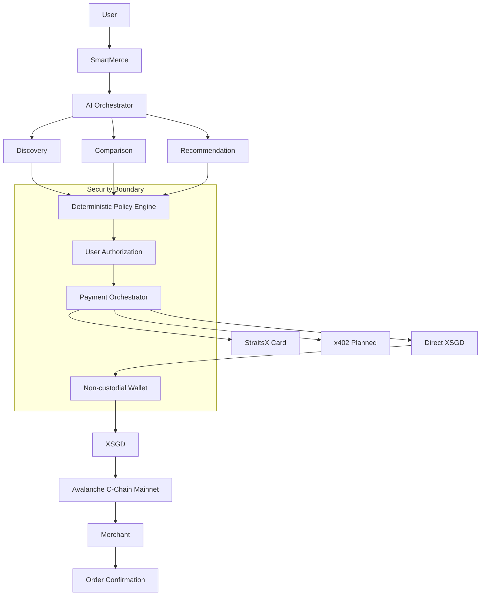

# SmartMerce

**AI that shops. You stay in control.**

SmartMerce is an AI commerce agent for the StraitsX AgentiX Playground Hackathon, AI Commerce Agents track. A shopper describes what they want, SmartMerce discovers and compares trusted products, recommends the best option, validates deterministic spending rules, asks for user authorization, and prepares payment infrastructure.

## The Problem

AI agents are becoming capable of making increasingly sophisticated decisions, but giving probabilistic software unrestricted access to financial accounts is unsafe.

## The Solution

SmartMerce separates intelligence from financial authority.

AI:

- discovers
- compares
- recommends
- explains

Deterministic infrastructure:

- limits
- authorizes
- verifies
- executes only after explicit user action

Core message:

> AI should decide what to buy, not whether it is allowed to spend your money.

## How It Works

1. User describes purchase intent.
2. SmartMerce parses intent with a provider abstraction and deterministic fallback.
3. SmartMerce discovers products from a trusted local merchant catalogue.
4. The agent compares candidates by price, rating, reviews, shipping and value.
5. SmartMerce recommends the best option with factual catalogue-backed reasons.
6. The spending policy validates transaction limit, daily limit, merchant allowlist, stock, server price and user budget.
7. The user authorizes an exact product, merchant and amount.
8. Payment infrastructure prepares Direct XSGD on Avalanche Mainnet when official configuration is present.
9. Checkout verifies product, authorization, policy and payment proof server-side.
10. Merchant dashboard receives confirmed orders.

## Architecture



Prominent rule:

> The LLM recommends actions. Deterministic systems authorize money movement.

## XSGD

Direct XSGD transfer support is implemented with `viem`, but real transfers are disabled until:

- `NEXT_PUBLIC_XSGD_CONTRACT` contains the verified official XSGD contract on Avalanche C-Chain Mainnet.
- `NEXT_PUBLIC_MERCHANT_WALLET` contains a trusted EVM merchant wallet.
- The connected wallet is on chain `43114`.
- The user explicitly confirms in the wallet.

SmartMerce does not guess token contracts or merchant wallets.

## Avalanche

Network target:

- Avalanche C-Chain Mainnet
- Chain ID: `43114`
- Hex chain ID: `0xA86A`
- Native gas asset: `AVAX`
- RPC: `https://api.avax.network/ext/bc/C/rpc`

The app verifies chain `43114` before payment and blocks payment on other chains.

## StraitsX

StraitsX sandbox MCP discovery has been implemented in `scripts/inspect-straitsx-mcp.ts`.

Discovered sandbox tools:

- `get_card_sandbox`
- `view_card_sandbox`

The discovered sandbox card tool targets Avalanche Fuji testnet `43113`, not Avalanche Mainnet. Mainnet card issuance is therefore intentionally disabled until production tools, credentials and hackathon approval are verified.

Discovery output is saved in `docs/STRAITSX_MCP_TOOLS.md`.

## x402

x402 is not implemented. The repository does not claim x402 support because no real x402 payment flow has been wired and verified.

## AWS

AWS is not implemented. The AI provider abstraction can support Amazon Bedrock later, but this repository does not claim Bedrock usage.

## Security

SmartMerce uses these safety controls:

- Non-custodial wallet signing through Core Wallet or MetaMask.
- No private keys, seed phrases or recovery phrases requested or stored.
- Explicit user authorization before payment.
- Deterministic transaction and daily limits.
- Merchant allowlisting.
- Server-side price verification.
- Short-lived five-minute authorization.
- Network validation for Avalanche C-Chain Mainnet.
- No arbitrary LLM transactions.
- Server-side checkout verification.

## Tech Stack

- Next.js App Router
- TypeScript
- Tailwind CSS
- Zod
- lucide-react
- viem
- Model Context Protocol SDK
- Vitest

## Local Development

```bash
npm install
npm run dev
```

Open:

- Main app: `http://localhost:3000`
- Merchant console: `http://localhost:3000/merchant`
- Architecture: `http://localhost:3000/architecture`

## Environment Variables

```bash
AI_PROVIDER=
AI_API_KEY=
NEXT_PUBLIC_DEMO_MODE=true
NEXT_PUBLIC_AVALANCHE_CHAIN_ID=43114
NEXT_PUBLIC_AVALANCHE_RPC_URL=https://api.avax.network/ext/bc/C/rpc
NEXT_PUBLIC_XSGD_CONTRACT=
NEXT_PUBLIC_MERCHANT_WALLET=
STRAITSX_CARD_MCP_SANDBOX_URL=https://card.straitsx.ai/sandbox/sse
STRAITSX_CARD_MCP_PRODUCTION_URL=https://card.straitsx.ai/production/sse
STRAITSX_CARD_ENV=sandbox
STRAITSX_MCP_TOKEN=
```

Do not expose `STRAITSX_MCP_TOKEN` with a `NEXT_PUBLIC_` prefix.

## Quality Commands

```bash
npm run typecheck
npm run lint
npm run test
npm run build
npm run inspect:straitsx
```

## Deployment

The app is prepared for Vercel.

1. Push the repository to GitHub.
2. Import the project into Vercel.
3. Add the environment variables above.
4. Keep MCP secrets server-side.
5. Deploy.
6. Verify `/`, `/merchant`, `/architecture` and API routes.

## Hackathon Track

Primary track: AI Commerce Agents.

## Sponsor Alignment

- StraitsX: XSGD, card MCP discovery, future card issuance path.
- Avalanche: C-Chain Mainnet wallet, AVAX balance, XSGD payment path.
- AWS: not used.
